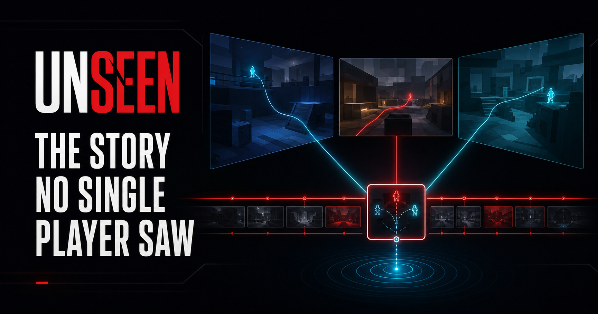
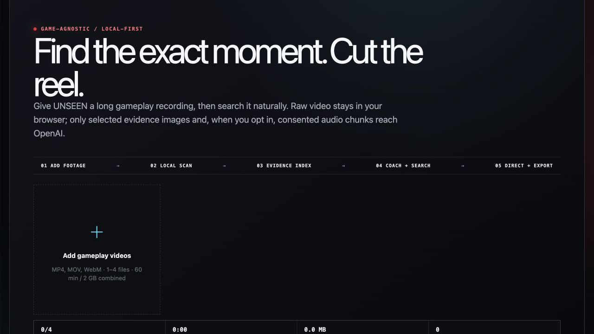
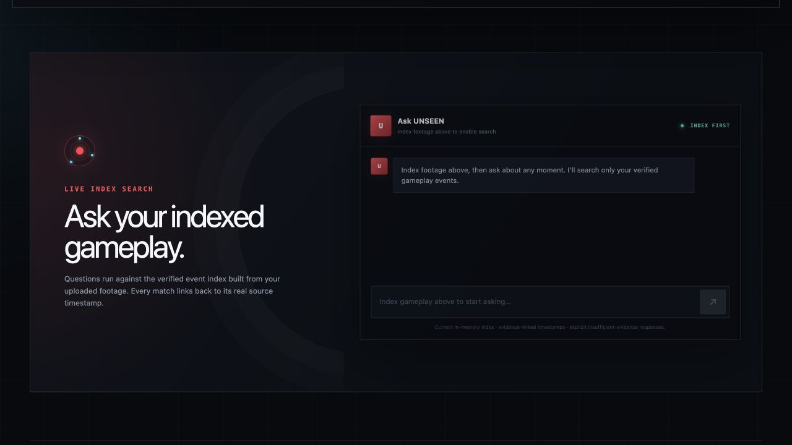
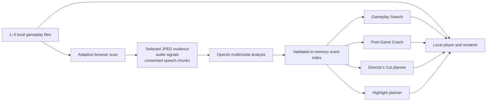

# UNSEEN

### The AI replay layer for Garena games

**Find any moment. Learn from every decision. Relive the story no single player saw.**

[](https://unseen-squad-story.iians0n.chatgpt.site/)


[](https://github.com/ClarenceChoo/Garena-AI-Build-Challenge/actions/workflows/deploy.yml)

<a href="https://unseen-squad-story.iians0n.chatgpt.site/">
  
</a>

UNSEEN turns long gameplay recordings into a private, searchable match memory.
One evidence index powers exact-moment retrieval, AI post-game coaching, a
multi-perspective Director's Cut, and social-ready highlight reels—without
uploading the raw videos.

> **For Garena judges:** start with [the two-minute demo](#try-the-complete-experience),
> then use [the judge-ready local setup](#run-locally). The hosted demo is private
> and requires an allowlisted ChatGPT email; localhost uses a development-only
> auth bypass.

## The problem

A kill feed records the outcome, not the story. While one player clutches, a
teammate may be stopping a flank, spending the last utility, or causing the
reaction everyone remembers. Those moments are scattered across long recordings
and usually disappear.

Conventional highlight tools find one player's obvious peaks. UNSEEN creates a
source-bound event layer across one to four recordings, then turns that same
evidence into five connected experiences.

## One index, five experiences

| Experience | What the player gets |
| --- | --- |
| **Gameplay Search** | Natural-language retrieval with exact, playable source citations |
| **Post-Game Review** | Evidence-grounded strengths, improvements, ratings, and next-match drills |
| **Ask Coach** | Follow-up advice scoped to the selected player or team |
| **Director's Cut** | An AI-planned, multi-source playback story using the original local files |
| **Highlight Reel** | A downloadable 30/60/90-second landscape or vertical edit |

## See the product

### 1. Index once

UNSEEN adaptively scans long footage in the browser and builds a temporary event
index. The raw files remain on the device.



### 2. Search like you remember it

Ask for a moment in natural language. Results are ranked, evidence-linked, and
open the original video two seconds before the cited event. Weak support returns
`insufficient_evidence` instead of an invented timestamp.



### 3. Turn evidence into improvement

After indexing, UNSEEN automatically produces a review for each perspective and
a Squad review only when the sources can be reliably linked to the same session.
Every observed rating and coaching claim cites indexed events. Unsupported
categories show **Not observed**.

### 4. Relive and share

Play an AI-planned Director's Cut across the original local sources, or download
a 30/60/90-second MP4/WebM reel with validated cuts and evidence-based captions.

## Try the complete experience

For the fastest live review, use current Chrome or Edge and a 2–5 minute H.264/AAC
MP4. Keep a pre-indexed tab open as a backup because refreshing intentionally
clears the private in-memory index.

1. Add and label one gameplay recording. Use matching squad POVs to demonstrate
   team review and Director source switching.
2. Confirm recording permission. Leave voice analysis off for the fastest run,
   or enable it only when everyone audible has agreed.
3. Select **Index footage with AI** and watch the detected game context and
   verified event count appear.
4. Search for a moment you know occurs, such as **“When did I get flanked?”**,
   **“Find the final clutch”**, or **“Where did we lose the objective?”**
5. Open a cited result, compare it with the AI Post-Game Review, and ask Coach
   what to improve next match.
6. Play the Director's Cut, then generate a 30-second vertical or landscape reel.


## Why UNSEEN is different

| Capability | Manual clipping | Typical AI highlights | UNSEEN |
| --- | --- | --- | --- |
| Find a moment | Scrub the timeline | Detect obvious peaks | Search naturally |
| Perspective | One recording | Usually one recording | 1–4 sources; team views only when supported |
| Understanding | Editor judgment | Kills and visual spikes | HUD, objectives, reactions, dialogue, mistakes, teamwork |
| Outputs | Individual clips | Highlight montage | Search, coaching, Director's Cut, and reel |
| Trust | No evidence layer | Often opaque | Frame/transcript citations, validation, and abstention |
| Media handling | Editor-dependent | Often uploads full video | Raw video remains browser-local |

## Use cases

| User | Example request | Outcome |
| --- | --- | --- |
| **Player** | “Why did I lose the final clutch?” | Cited review and a concrete next-match drill |
| **Squad / coach** | “What happened while I pushed?” | Cross-source context when a shared session is supported |
| **Creator** | “Make a 30-second reel of our funniest reactions” | Downloadable social edit without manual timeline scrubbing |
| **Esports analyst** | “Find every late-round elimination” | Ranked moments with exact playback |
| **Garena community team** | “Turn this match into a recap” | A permissioned post-match retention and sharing loop |

## How it works



| Bound | Prototype value |
| --- | --- |
| Recordings | 1–4 local files |
| Session limit | 60 minutes / 2 GiB combined |
| Segment evidence | At most 24 selected images per two-minute segment |
| Parallelism | Up to four segment requests, device permitting |
| Search results | Up to five ranked, playable matches |
| Reel outputs | 30/60/90 seconds; landscape or vertical |

The browser performs a balanced local scan every two seconds, retains ten-second
context, and adds evidence around scene/HUD changes and audio-energy spikes.
Low-detail context and high-detail candidate/HUD frames control vision cost while
retaining short gameplay events. Failed segments retry once without rebuilding
successful work.

The model interprets evidence and returns strict structured data; application
code remains authoritative. Unknown evidence IDs are rejected, timestamps are
clamped to real source durations, overlapping edits are removed, and model text
is never executed as a media command.

See [`docs/AI_PIPELINE.md`](docs/AI_PIPELINE.md) for the detailed pipeline.

## Evidence and privacy

- Raw video remains behind browser-local `File`/blob access.
- Only selected JPEG frames, numeric audio signals, and explicitly enabled voice
  chunks reach OpenAI.
- Search, review, Coach, and Director planning use the compact event index—not
  raw media bytes.
- Voice transcription is optional and must be enabled only when everyone audible
  has consented.
- Unknown clip, event, frame, and transcript IDs are rejected.
- Weak support returns `insufficient_evidence`; unsupported coaching dimensions
  show **Not observed**.
- The index lives only in page memory and disappears on reload. There is no D1,
  R2, or persistent upload store.
- The hosted demo is protected by Sign in with ChatGPT and a server-side email
  allowlist.
- OpenAI requests use `store: false`; missing API configuration fails closed and
  never substitutes scripted results.

## Run locally

### Requirements

- Node.js `22.13.0` or newer
- Current Chrome or Edge
- An OpenAI API key with available credits
- No database, migrations, D1, or R2 setup

### 1. Install

```bash
git clone https://github.com/ClarenceChoo/Garena-AI-Build-Challenge.git
cd Garena-AI-Build-Challenge
npm ci
cp .env.example .env.local
```

### 2. Configure

For local judging, set at least these values in `.env.local`:

```dotenv
OPENAI_API_KEY=your_server_side_key
UNSEEN_LOCAL_AUTH_BYPASS=true
```

`UNSEEN_LOCAL_AUTH_BYPASS` works only outside production and creates a local
development user. Never expose the API key through a `NEXT_PUBLIC_` variable,
commit `.env.local`, or paste the key into the browser.

Optional model configuration is already documented in [`.env.example`](.env.example):

| Variable | Default / behavior |
| --- | --- |
| `OPENAI_SEARCH_MODEL` | Search/index/highlight model; falls back to vision, then `gpt-5.6-sol` |
| `OPENAI_COACH_MODEL` | Review and Ask Coach; falls back to search/vision |
| `OPENAI_SEARCH_TRANSCRIPTION_MODEL` | `whisper-1` |
| `OPENAI_VISION_MODEL` | `gpt-5.6-sol` |
| `UNSEEN_ALLOWED_EMAILS` | Comma-separated production tester allowlist; not needed locally |

### 3. Start and verify

```bash
npm run dev
```

Open the printed URL, normally `http://localhost:3000`.

Before judging or submitting:

```bash
npm run lint
npm test
```

`npm test` creates a production build and runs all 17 automated tests. A separate
`npm run build` is optional.

### Troubleshooting

| Symptom | Fix |
| --- | --- |
| Index button is disabled | Add a valid clip and confirm recording permission |
| `AI_NOT_CONFIGURED` | Verify `OPENAI_API_KEY`, then restart the dev server |
| Video will not decode | Convert to H.264/AAC MP4 and use current Chrome/Edge |
| A live run is slow | Start with one 2–5 minute clip and leave voice analysis off |
| Team review is absent | Use matching POVs from the same session; UNSEEN will not guess the relationship |
| Search abstains | Try a visually supported query or clearer footage; no timestamp is invented |

## How to source gameplay clips

For the strongest judge demo, use gameplay recorded by your own team. That keeps
provenance, player permission, and source quality clear.

### Recommended sources

| Source | Best use |
| --- | --- |
| **Your own Free Fire / Free Fire MAX recording** | Most authentic end-to-end Garena demo |
| **Same-match recordings from consenting squadmates** | Team review and Director source switching |
| **Garena-organizer or rights-cleared footage** | Esports and broadcast analysis demonstrations |
| **`public/demo/*.mp4`** | Permission-safe, deterministic engineering fallback |

Record with the device screen recorder, OBS, Xbox Game Bar, or a capture card.
Use 720p/1080p footage with a readable HUD, timer, player names, kill feed, and
one event you already know how to find. H.264/AAC MP4 is the most reliable demo
format; MP4, MOV, and WebM are accepted, with MKV decoding dependent on the
browser codec stack.

For multi-perspective testing, ask every squad member to record the same match,
start before matchmaking or the round countdown, keep the original files
unedited, and label each perspective accurately. Enable voice analysis only
after every audible player has agreed.

Garena has documented Free Fire recording and Replay features, including
first/third-person replay, event markers, and automatic highlights:

- [Free Recording update](https://ff.garena.com/en/article/1170/)
- [Replay and highlight tools](https://ff.garena.com/en-pk/article/915/)
- [Replay improvements](https://ff.garena.com/en/article/1120/)
- [Android screen-recording instructions](https://support.google.com/android/answer/9075928?hl=en)
- [iPhone screen-recording instructions](https://support.apple.com/en-us/102653)

Those Garena links are historical patch notes; verify feature availability in
the current client, device, and region. If a Replay cannot be exported, screen-
record it while it plays.

### Bundled fixture: safe, synthetic, and fast

The committed `public/demo/ace.mp4`, `rin.mp4`, and `miko.mp4` files are
**fictional Arena Strike fixtures—not Garena gameplay**. Each is 13:48 and all
three fit within the session limits, but the full set takes longer to live-index.

For a quick three-POV engineering demo, create 35-second final-round clips with
FFmpeg:

```bash
mkdir -p /tmp/unseen-judge-clips

for player in ace rin miko; do
  ffmpeg -y -ss 675 -i "public/demo/${player}.mp4" -t 35 \
    -c:v libx264 -preset veryfast -crf 20 -c:a aac \
    "/tmp/unseen-judge-clips/${player}-final-round.mp4"
done
```

Upload the three outputs, label them Ace/Rin/Miko, and try **“When does Ace win
the final 1v2?”** or **“What was Rin doing during the final clutch?”**

### Rights and consent

Official esports broadcasts are excellent inspiration, but public availability
is not permission to download, edit, analyze, or redistribute them. For third-
party creator or tournament clips, obtain written permission covering analysis,
editing, demo use, and redistribution. Preserve the source record and do not
remove watermarks or imply Garena endorsement.

When permission is unavailable, link to or embed the official player instead of
bundling the footage in this repository or hosted demo. Review the
[Garena Terms of Service](https://content.garena.com/legal/tos/tos_en.html),
[Free Fire Community Standards](https://content.garena.com/legal/ugc/ugc-EN.html),
and [YouTube Terms of Service](https://www.youtube.com/t/terms). This is practical
project guidance, not legal advice.

## Roadmap: from upload to a Garena-native experience

### Phase 1 — Browser-local proof of concept (now)

Manual upload, adaptive multimodal indexing, natural-language search, coaching,
Director playback, and local reel export.

### Phase 2 — One-tap mobile handoff

Add Android and iOS share targets so a player can send a Free Fire recording or
Replay export directly from the gallery to UNSEEN. Preserve match labels and
begin local indexing in the background.

### Phase 3 — Native post-match ingestion

Integrate UNSEEN with the Garena game client or replay service so clips are
automatically and privately fed into the system after an opted-in match. A signed
match manifest could provide:

```text
match ID · pseudonymous player ID · replay/clip pointer · round clock anchors
eliminations · assists · objectives · squad relationship · voice permission
```

First-party timestamps would replace uncertain OCR alignment, reducing latency
and inference cost while increasing accuracy. Vision could enrich authoritative
telemetry with positioning, reactions, mistakes, and story context.

### Phase 4 — “Your UNSEEN is ready”

After a session ends, each opted-in player receives a private in-game
notification linking to:

- **What You Missed**
- **Search this match**
- **Personal and Squad coaching**
- **Director's Cut**
- **One-tap social reel creation**

### Phase 5 — Garena storytelling platform

Extend the same permissioned evidence layer to creators, coaches, esports teams,
tournament production, and community events. Add multilingual coaching,
regional retention controls, parental safeguards, deletion lineage, evaluation,
and on-device candidate detection.

> **Long-term vision:** from “match completed” to “your story is ready” without a
> manual upload. Automatic ingestion remains opt-in and player-controlled.

## API and implementation map

| Route / module | Responsibility |
| --- | --- |
| `POST /api/analyze/index-segment` | Evidence-linked events from bounded two-minute segments |
| `POST /api/analyze/search` | Validated ranked hits or explicit insufficient evidence |
| `POST /api/analyze/review` | Player/team coaching and optional Director plan |
| `POST /api/analyze/coach` | Evidence-scoped follow-up coaching |
| `POST /api/analyze/highlights` | Typed, validated highlight plan |
| `POST /api/analyze/transcribe` | Consented timestamped voice chunks under 25 MB |
| [`lib/gameplay-search-client.ts`](lib/gameplay-search-client.ts) | Local scanning, audio chunking, playback, codec selection, rendering |
| [`lib/gameplay-search-openai.ts`](lib/gameplay-search-openai.ts) | OpenAI calls, schemas, evidence validation, clamping, fail-closed errors |
| [`lib/gameplay-search-types.ts`](lib/gameplay-search-types.ts) | Shared event, search, review, coach, Director, and highlight contracts |
| [`app/components/gameplay-search-workbench.tsx`](app/components/gameplay-search-workbench.tsx) | Primary product experience |

## Validation and prototype boundaries

The 17-test suite covers production rendering, authentication, structured
request shape, OpenAI provenance, event citation validation, unknown-evidence
rejection, consent-gated transcription, explicit abstention, review/source
mapping, rating gates, Director clamping, bounded Coach history, and reel
timestamp validation.

This proof of concept uses best-effort model vision for HUD reading. It does not
run dense frame-by-frame tracking, persistent player re-identification,
server-side FFmpeg, a persistent media store, or a persistent semantic index.
Current Chrome and Edge are the supported demo browsers. Director's Cut is a
temporary local playback plan; the social reel is the downloadable output.

Production would additionally require authenticated session ownership,
viewer-scoped retention and deletion controls, encrypted short-lived media
handling, first-party telemetry contracts, abuse evaluation, and complete
consent/revocation lineage.

## Garena AI Build Challenge evaluation map

| Judge lens | Product proof |
| --- | --- |
| **Innovation** | One evidence index powers retrieval, coaching, storytelling, and creation |
| **AI depth** | Multimodal vision, HUD/OCR interpretation, audio signals, optional transcription, structured reasoning |
| **User value** | Saves footage-search time and creates immediate learning and sharing outcomes |
| **Trust** | Exact citations, ID validation, timestamp clamping, consent gates, and abstention |
| **Feasibility** | Adaptive sampling and bounded parallelism avoid full-video API upload |
| **Garena potential** | Native replay/telemetry ingestion creates a scalable post-match engagement loop |

## Third-party disclosure

| Component | Use |
| --- | --- |
| OpenAI Responses API / `gpt-5.6-sol` | Vision indexing, search, reviews, coaching, Director and highlight planning |
| OpenAI Audio Transcriptions API / `whisper-1` | Optional consented timestamped speech transcription |
| `mediabunny` 1.51.0 | Browser media decoding and MP4/WebM reel rendering |
| Next.js, React, vinext, Vite | Application and Cloudflare-compatible build stack |

Exact direct versions and licenses are in [`package.json`](package.json) and the
locked dependency graph in [`package-lock.json`](package-lock.json). The
fictional media fixture and its timed sources are disclosed in `public/demo/`,
`assets/demo/`, and [`lib/unseen-fixture.ts`](lib/unseen-fixture.ts). No separately
trained model, scraped dataset, biometric dataset, persistent upload store, or
persistent real-player dataset is included.

## Deployment

The hosted demo is published with OpenAI Sites. The separate
[`deploy.yml`](.github/workflows/deploy.yml) workflow runs validation on pushes
to `main` and can deploy to Cloudflare Workers when the required repository
secrets are present. Production access remains protected by identity plus the
server-side `UNSEEN_ALLOWED_EMAILS` allowlist.
